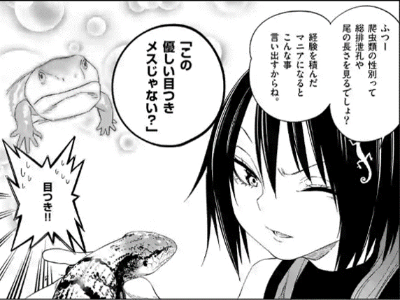

# GCP-AutoML-Vision-TIL
## Abstract
When I'm reading manga about reptile, this image lead me to try creating the model of Sexual discrimination of reptile by the image of only face.
I looked for the dataset of male and female reptile(common leopard gecko), but I cannot to find. Instead of this, I did the discrimination of 
turtle and pitted-shell turtle(the animal like turtle). I prepared the dataset for turtle(59 images) and
pitted-shell turtle(92 images) by google image. I used AutoML vision(GCP) for the learning of model.   
  
  
ref:秘密のレプタイルズ,85,9
## Result
This is the result.  
About turtle images, high accuracy were shown.  
    
  

  
About pitted-shell turtle(suppon means), one was shown high accuracy, but another was shown low accuracy. It is thought that the number of 
image of dataset.   
  
  
  
  
This is anime's pitted-shell turtle.
In this case, high accuracy was shown.
  
 
## Future Plan
I am going to collect the image of dataset and try again.  
Furthermore, I want to creat the model of sexual discrimination of reptile(especially common leopard gecko) by only the face.
So, I will collect the image!
 
